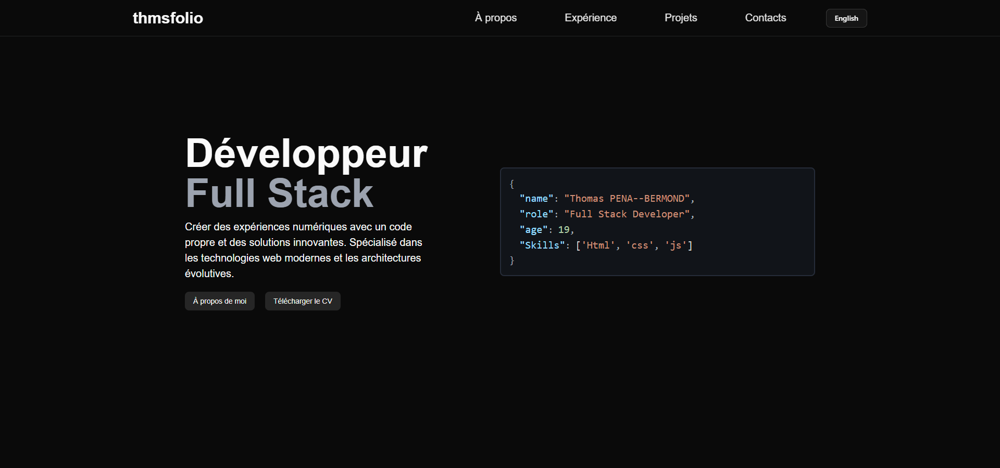
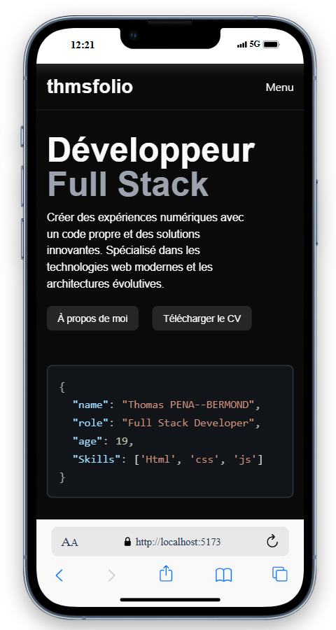

# thmsfolio - Personal portfolio [](#)

**thmsfolio** is a fully responsive personal portfolio website, responsive for all devices, built using React. It adapts to all devices and showcases my projects, skills, and journey.

## Table of Contents

- [Screenshots](#screenshots)
- [Features](#features)
- [Teck Stack](#teck-Stack)
- [Installation](#installation)
- [Project content](#project-content)
- [License](#license)
- [Contact](#contact)

## Screenshots

### Desktop View



### Mobile View



## Features

- Design

## Teck Stack

### Description

- **react** - TypeScript library for building user interfaces
- **i18n** - Translation from English and French
- **shadcn/ui** - Reusable UI components built on Radix UI and Tailwind CSS
- **react-icons** - Icon library for languages
- **lucide-react** - Icon library for icon

### Dependencies

**@hookform/resolvers**: _v5.2.1_,
**@radix-ui/react-accordion**: _v1.2.12_,
**@radix-ui/react-aspect-ratio**: _v1.1.7_,
**@radix-ui/react-dropdown-menu**: _v2.1.16_,
**@radix-ui/react-label**: _v2.1.7_,
**@radix-ui/react-menubar**: _v1.1.16_,
**@radix-ui/react-slot**: _v1.2.3_,
**@tailwindcss/vite**: _v4.1.12_,
**animejs**: _v4.1.3_,
**class-variance-authority**: _v0.7.1_,
**clsx**: _v2.1.1_,
**gsap**: _v3.13.0_,
**i18next**: _v25.4.0_,
**i18next-browser-languagedetector**: _v8.2.0_,
**i18next-http-backend**: _v3.0.2_,
**lucide-react**: *v0.540.**,
**ogl: *v1.0.11*,
**react**: *v19.1.1*,
**react-dom**: *v19.1.1*,
**react-hook-form**: *v7.62.0*,
**react-i18next**: *v15.7.1*,
**react-icons**: *v5.5.0*,
**react-router-dom**: *v7.8.1*,
**react-router-hash-link**: *v2.4.3*,
**sass**: *v1.90.0*,
**sonner**: *v2.0.7*,
**tailwind-merge**: *v3.3.1*,
**tailwindcss**: *v4.1.12*,
**zod**: *v4.0.17\*

## Installation

### Prerequisites

- npm >= v10.9.2
- Node.js >= v22.14.0

### Launch the project locally

```bash
git clone https://github.com/Inhumannn/portfolioo
cd name-of-repo
npm install
npm run dev
```

## Project content

### Home page

- **Project 1** - _description_
- **Project 2** - _description_
- **Project 3** - _description_

_Other projects are available in the online portfolio._

### About page

### Experience page

### projects page

- **Project 1** - _description_
- **Project 2** - _description_
- **Project 3** - _description_
- **.........** - _..........._

### Contacts page

## License

This project is licensed under a [proprietary license](LICENSE.md).

## Contact

Feel free to reach out or follow me on [LinkedIn](https://www.linkedin.com/in/thomas-pena-bermond/) or [GitHub](https://github.com/Inhumannn).

## Frequently Asked Questions (FAQ) / Troubleshooting
